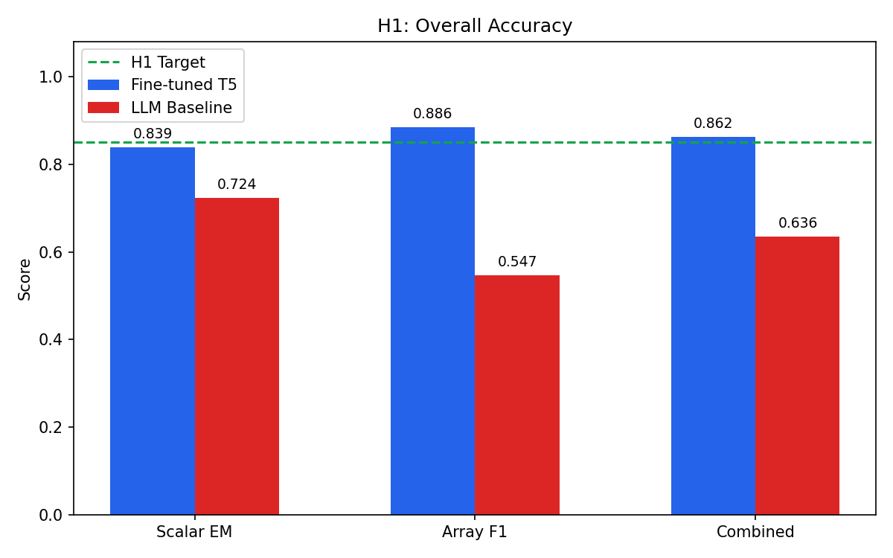
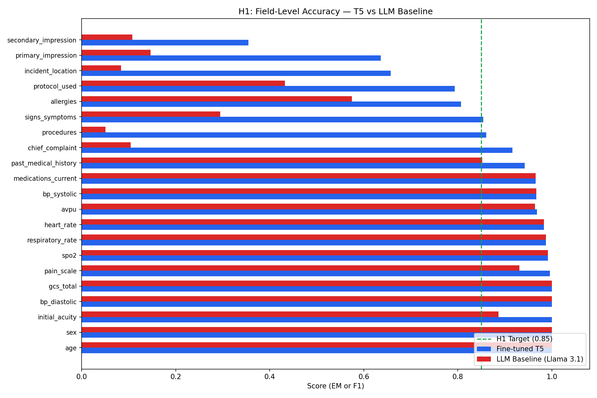
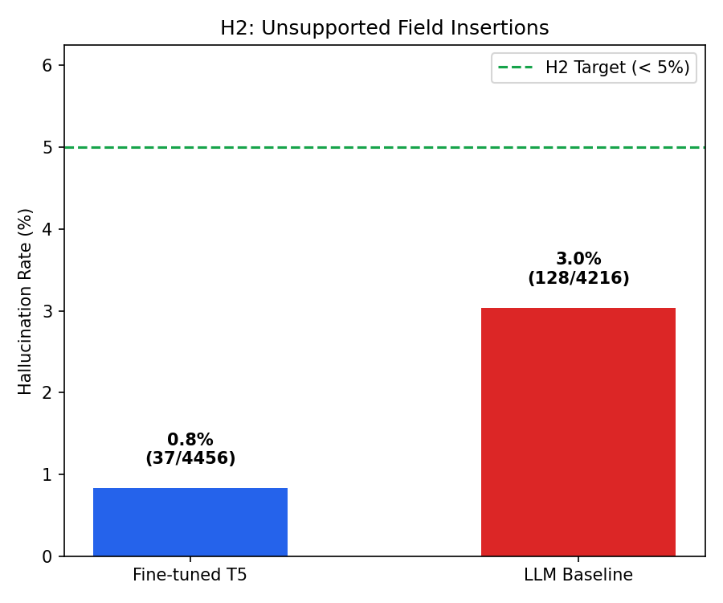
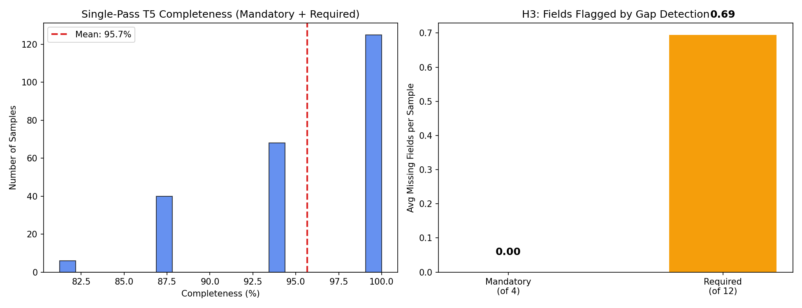
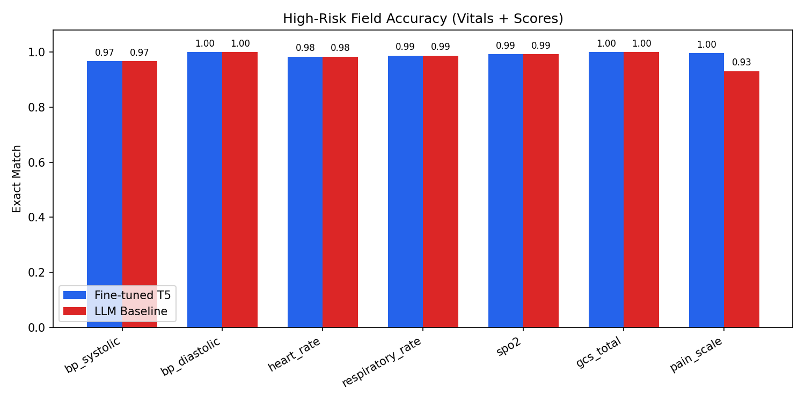
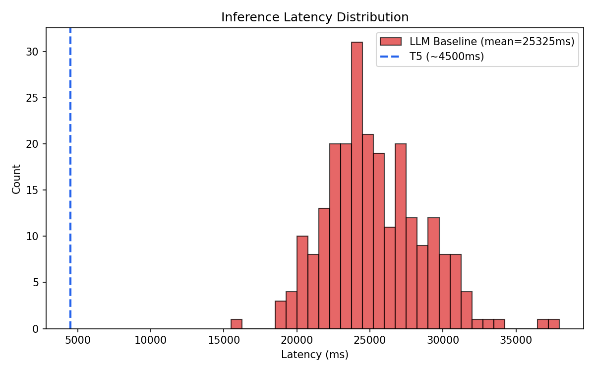

# MEDIC — Voice-to-PCR EMS Documentation Assistant

Fully local voice-driven assistant that converts paramedic speech into structured Pre-hospital Care Reports (PCR) in real time. Wake word activation → VAD auto-stop → speech recognition → structured extraction → gap detection → LLM completion → voice corrections — **zero cloud dependency, no PHI leaves the device**.

**Course:** CS 6170 Human-AI Interaction, Northeastern University  
**Team:** Akshatt Kain · Anubhab Das · Ksheeraj Prakash · Shashwat Singh

---

## Table of Contents

- [Architecture](#architecture)
- [Tech Stack](#tech-stack)
- [ML Models](#ml-models)
- [PCR Schema](#pcr-schema)
- [Hypothesis Evaluation](#hypothesis-evaluation)
- [Quick Start](#quick-start)
- [Project Structure](#project-structure)
- [Data Pipeline](#data-pipeline)
- [Evaluation Results](#evaluation-results)
- [Key Technical Details](#key-technical-details)
- [Known Gaps](#known-gaps)
- [Common Commands](#common-commands)

---

## Architecture

```
Wake Word ("Hey MEDIC" — Web Speech API)
        │
        ↓
Voice Activity Detection (VAD — auto-stop on 2s silence)
        │
        ↓
Whisper medium (local STT on CPU)
        │
        ↓
Intent Detection (correction vs new data)
        │
        ├── Correction → Ollama correction parser → PCR state update
        │
        └── New data ↓
                     ↓
        Fine-tuned T5-base (structured PCR extraction)
                     │
                     ↓
        Vitals Validation (physiological range checks)
                     │
                     ↓
        Gap Detection (missing field identification)
                     │
                     ├── Deterministic rules (AVPU, allergies)
                     └── Llama 3.1 8B (explicit value recovery)
                     │
                     ↓
        PCR JSON (23 fields) → Export on Finalize
                     │
                     ↓
        React Frontend + React Native Mobile
```

---

## Tech Stack

| Layer | Technology |
|---|---|
| **Wake Word** | Web Speech API (trigger phrase only, no PHI) |
| **VAD** | Web Audio API RMS-based silence detection |
| **Speech-to-Text** | Whisper medium (local, CPU) |
| **Structured Extraction** | Fine-tuned T5-base |
| **Gap Completion** | Deterministic rules + Llama 3.1 8B via Ollama (fully local) |
| **Corrections** | Ollama correction parser (natural language → field updates) |
| **Vitals Validation** | Physiological range checks (rejects impossible values) |
| **Training Data** | NEMSIS v3.5 2024 public release — 60M EMS activations, all 53 US states/territories |
| **Synthetic Generation** | Gemini 2.5 Pro (batch generation, NEMSIS-grounded scenarios) |
| **Training Infra** | Google Colab L4 GPU |
| **Inference** | MacBook (CPU for Whisper + T5, Ollama for Llama) |
| **Backend** | FastAPI, WebSocket real-time updates |
| **Frontend** | React 19 + TypeScript, Vite, Tailwind |
| **Mobile** | React Native (Expo) |
| **Evaluation** | Exact Match, Field-level F1, ROUGE-L |

---

## ML Models

| Model | Task | Training Data | Output |
|---|---|---|---|
| Whisper medium | Speech → transcript | Pre-trained (OpenAI) | Raw paramedic transcript |
| T5-base (fine-tuned) | Transcript → structured PCR | 1,920 synthetic samples, 10 epochs, LR 3e-4 | 23-field PCR key-value pairs |
| Llama 3.1 8B | Gap completion + corrections | Zero-shot via Ollama | Recovered fields + parsed corrections |

**Training split**: 1,920 train / 239 val / 239 test

---

## PCR Schema

23 fields extracted from paramedic speech:

| Category | Fields |
|---|---|
| **Demographics** | age, sex |
| **Assessment** | chief_complaint, primary_impression, secondary_impression, initial_acuity |
| **Vitals** | bp_systolic, bp_diastolic, heart_rate, respiratory_rate, spo2, gcs_total, avpu, pain_scale |
| **History** | allergies, medications_current, past_medical_history, events_leading |
| **Treatment** | medications_given (drug/dose/unit/route), procedures, protocol_used |
| **Scene** | incident_location, signs_symptoms |

---

## Hypothesis Evaluation

### H1: Fine-tuned T5 achieves higher field-level accuracy (F1 > 0.85) than prompted LLM baseline

| Metric | Fine-tuned T5 | LLM Baseline (Llama 3.1 8B) |
|---|---|---|
| Scalar Exact Match | 0.839 | 0.724 |
| Array F1 | 0.886 | 0.547 |
| **Combined** | **0.862** | **0.636** |

**Result: H1 PASSED** — T5 combined score (0.862) exceeds the 0.85 threshold and outperforms the LLM baseline by 22.6 percentage points.




### H2: Fine-tuned T5 produces lower hallucination rate (< 5%) than LLM baseline

| Model | Hallucinated Fields | Total Filled Fields | Hallucination Rate |
|---|---|---|---|
| Fine-tuned T5 | 37 | 4,456 | **0.8%** |
| LLM Baseline | 128 | 4,216 | **3.0%** |

**Result: H2 PASSED** — T5 hallucination rate (0.8%) is well below the 5% target and 3.75x lower than the LLM baseline (3.0%).



### H3: Gap detection reduces missing mandatory fields

| Metric | Value |
|---|---|
| Avg completeness (single-pass T5) | 95.7% |
| Samples with gaps | 47.7% |
| Avg mandatory fields missing | 0.00 |
| Avg required fields missing | 0.69 |

**Result: H3 SUPPORTED** — T5 fills all mandatory fields on average. Gap detection identifies 0.69 missing required fields per sample, enabling targeted prompting to reach full completeness.



### Additional Results

**High-risk fields** (vitals + scores): Both models achieve 97-100% exact match, with T5 slightly outperforming on pain_scale (1.00 vs 0.93).



**Latency**: T5 inference at ~4.5s vs LLM at ~25.3s (5.6x faster).



---

## Quick Start

### Prerequisites

- Python 3.10+
- Node.js 18+
- [Ollama](https://ollama.ai) with `llama3.1:8b` pulled
- ffmpeg (`brew install ffmpeg`)
- Chrome browser (required for wake word)

### Installation

```bash
git clone https://github.com/Akshattkain/Voice-to-PCR-Assistant-for-EMS.git
cd Voice-to-PCR-Assistant-for-EMS

# Pull Llama for gap completion + corrections
ollama pull llama3.1:8b
```

### Run

```bash
# Terminal 1 — Ollama
ollama serve

# Terminal 2 — Backend
cd backend
pip install -r requirements.txt
pip install openai-whisper httpx
uvicorn app.main:app --reload --port 8000

# Terminal 3 — Frontend
cd frontend
npm install
npm run dev
# → http://localhost:3000
```

Open `http://localhost:3000` in **Chrome**, click the wake word button (green), say "Hey MEDIC" followed by patient data.

---

## Project Structure

| Module | Purpose |
|---|---|
| `backend/` | FastAPI backend — ASR, extraction, corrections, gap detection, export |
| `backend/app/services/asr/` | Local Whisper ASR service |
| `backend/app/services/extraction/` | Fine-tuned T5 extractor |
| `backend/app/services/llm/` | Ollama client for gap completion + corrections |
| `backend/app/services/correction/` | Natural language correction parser |
| `backend/app/core/` | PCR state manager, gap detector, vitals validator |
| `frontend/` | React 19 + TypeScript dashboard |
| `mobile/` | React Native (Expo) mobile app |
| `shared/` | Cross-platform types, stores, utilities |
| `data/distributions.json` | NEMSIS field distributions from 60M activations |
| `data/medic-synthetic/` | Synthetic training data (train/val/test.jsonl) |
| `data/charts/` | Evaluation charts (H1, H2, H3, latency, high-risk) |
| `models/` | T5-base fine-tuned checkpoint |
| `scripts/` | Data generation, training, evaluation, hypothesis testing |

---

## Data Pipeline

```
1. Extract      preprocess_nemsis.py → distributions.json (60M NEMSIS activations)
2. Generate     generate_data.py (Gemini 2.5 Pro) → data/medic-synthetic/ (2,398 samples)
3. Clean        fix_medic_data.py → data/medic_synthetic_fixed/
4. Train        t5_train.py → models/ (best checkpoint at epoch 9)
5. Evaluate     evaluate_t5.py → data/eval_results.json
6. Baseline     evaluate_hypotheses.py → data/llm_baseline_results.json + data/charts/
```

**Data volumes**: 60M NEMSIS activations (148 GB uncompressed), 2,398 validated synthetic samples

---

## Evaluation Results

T5-base | Trained on 1,920 samples | Evaluated on 239 test samples

| Field | Metric | Score |
|---|---|---|
| age, sex, initial_acuity, gcs_total, bp_diastolic | Exact Match | 100.0% |
| bp_systolic, heart_rate, rr, spo2, pain_scale | Exact Match | 97–100% |
| chief_complaint | Exact Match | 91.6% |
| medications_current | F1 | 96.5% |
| past_medical_history | F1 | 94.2% |
| procedures | F1 | 86.0% |
| signs_symptoms | F1 | 85.4% |
| protocol_used | Exact Match | 79.4% |
| incident_location | Exact Match | 65.7% |
| primary_impression | Exact Match | 63.6% |
| secondary_impression | Exact Match | 35.4% |
| events_leading | ROUGE-L | — |
| **Overall Combined** | | **84.96%** |

---

## Key Technical Details

| Detail | Value |
|---|---|
| T5 input format | `"extract pcr: <transcript>"` |
| T5 target format | `"field1: value1 ; field2: value2 ; ..."` with `" \| "` array separator |
| NEMSIS delimiter | `~\|~` |
| NEMSIS encoding | `ESITUATION_11REF.txt` requires `latin-1` |
| Gemini SDK | `from google import genai` (new SDK, not `google.generativeai`) |
| Gemini model | `gemini-2.5-pro` (paid GCP key) |
| Training hardware | Colab L4 GPU, batch size 32 effective |
| Inference hardware | MacBook CPU (Whisper + T5), Ollama (Llama 3.1 8B) |
| Vitals validation | Physiological range checks reject impossible values (e.g. SpO2 > 100) |
| Wake word | Web Speech API — trigger phrase only, clinical audio stays local |
| VAD | RMS-based silence detection, 2s threshold for auto-stop |
| Hallucination rate | T5: 0.8%, LLM baseline: 3.0% |
| Latency | T5: ~4.5s, LLM: ~25.3s per extraction |

---

## Known Gaps

1. `events_leading` evaluation uses exact match — needs ROUGE-L scoring
2. `primary_impression` at 63.6% EM — planned improvement via T5-large on 5,000 samples
3. `secondary_impression` at 35.4% EM — rarely stated explicitly in transcripts
4. Whisper occasionally concatenates numbers (e.g. "SpO2 88" → "SPO 288") — vitals validator catches these
5. Compound correction commands ("change X and change Y") sometimes partially fail
6. Wake word requires Chrome — Safari and Firefox do not support Web Speech API
7. LLM gap completion can hallucinate (e.g. inferring GCS from alertness) — strict prompt guards mitigate this

---

## Common Commands

```bash
# Terminal 1 — Start Ollama
ollama serve

# Terminal 2 — Start backend
cd backend
uvicorn app.main:app --reload --port 8000

# Terminal 3 — Start frontend
cd frontend
npm run dev

# Run T5 evaluation
python scripts/evaluate_t5.py

# Run LLM baseline + generate hypothesis charts
python scripts/evaluate_hypotheses.py --run-baseline

# Regenerate charts from cached results
python scripts/evaluate_hypotheses.py --charts-only

# Generate synthetic data (requires Gemini API key)
python scripts/generate_data.py

# Clean generated data
python scripts/fix_medic_data.py

# Train T5-base (Colab L4 recommended)
python scripts/t5_train.py

# Pull Ollama model
ollama pull llama3.1:8b

# Extract NEMSIS distributions (requires raw NEMSIS data)
python scripts/preprocess_nemsis.py
```

---

## Novelty

- **First prehospital documentation assistant** trained on nationally representative EMS distributions spanning 60M activations across rural, urban, and suburban settings in all 53 US states/territories.
- **Fully local inference** — no PHI leaves the device. Whisper + T5 + Llama all run on-device.
- **Two-phase gap completion** — deterministic rules for safe transforms (AVPU, allergies) + LLM recovery for explicit missed values, with strict hallucination guardrails.
- **Vitals validation layer** — rejects physiologically impossible values before they enter the PCR state.
- **Voice correction routing** — intent detection distinguishes corrections from new patient data, enabling hands-free field updates.
- **Hypothesis-driven evaluation** — H1 (accuracy), H2 (hallucination), H3 (completeness) validated against LLM baseline on 239 test samples.

---

**Status**: Active Development | **Last Updated**: 2026-04-11